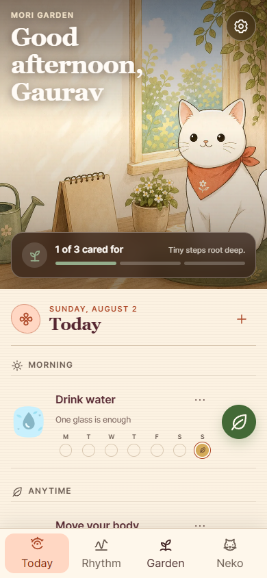

<div align="center">

# Kawaii Habit Tracker

### A sunlit pocket garden for gentle, imperfect routines

[](https://react.dev)
[](https://vite.dev)
[](https://kawaii-habit-tracker.vercel.app)
[](#verification)

</div>

<p align="center">
  
</p>

Kawaii Habit Tracker is a private, phone-first habit companion for Android, iPhone, and tablet browsers. Tiny versions count, planned rest never becomes failure, and ordinary care grows a small illustrated world. The default Sunlit Garden theme follows the warm watercolor direction; Moonlit Nook offers the same product under lantern light.

> **Status:** Version 1.1.0 is a verified release candidate. The repository builds as an installable offline-first PWA. A public deployment may lag behind the current branch.

## What is included

- **Fast Today loop:** habits grouped by morning, anytime, and evening, with seven-day context and one-tap completion.
- **Tiny and rest states:** mark the smallest honest version, record a rest day, attach a note, or reopen today without losing history.
- **Rhythm, not punishment:** a seven-day view, monthly trail, schedule-aware percentages, and protected rest days replace brittle streak pressure.
- **Living garden:** care points unlock original botanical keepsakes and grow longer goals without countdown anxiety.
- **Neko companion:** local planning and recovery guidance works offline; the optional API route adds AI responses while retaining a safe local fallback.
- **Full habit editing:** first-party illustrated icons, accent, part of day, daily/weekday/custom scheduling, notes, archive, and migration from legacy data.
- **Three coherent themes:** Sunlit Garden, Moonlit Nook, and Matcha Study preserve one component and icon language.
- **Local ownership:** versioned `localStorage`, defensive hydration, strict backup import, JSON export, and no account or analytics tracker.
- **Installable PWA:** custom app icons, maskable icon, pre-paint theme restoration, offline scene assets, and an accessible update prompt.
- **Accessible interaction:** semantic headings, labeled state, keyboard-trapped dialogs, focus restoration, inline Undo, 44px touch targets, reduced motion, and zoom support.

The app intentionally does not schedule background notifications. It stays quiet when closed instead of inventing unreliable reminder behavior on iOS and Android browsers.

## Run locally

Requirements: Node.js 20.19 or newer and npm.

```bash
npm install
npm run dev
```

Open `http://127.0.0.1:5173`.

## Verification

```bash
npm test
npm run lint
npm run build
npm audit
```

For the automated phone and tablet browser pass, keep the development server running in one terminal and run this in another:

```bash
npm run verify:visual
```

The visual check completes onboarding, verifies all four tabs, switches day and night themes, types in Settings to catch focus regressions, checks compact-phone overflow, and writes review screenshots to `docs/assets`.

The release device suite targets iPhone 15 Pro through Playwright's WebKit profile and Galaxy S24 Ultra through a touch-enabled Android/Chromium profile. It checks onboarding, every tab, 44px touch targets, 16px form text, tab scroll restoration, theme switching, WCAG A/AA scans, manifest icons and screenshot dimensions, service-worker scope, standalone display, installability, and the offline shell.

Install the WebKit runtime once, build, and serve the production app:

```bash
npx playwright-core install webkit
npm run build
npm run preview -- --host 127.0.0.1
```

Then run the suite in a second terminal:

```bash
npm run verify:devices
```

These are deterministic browser/device emulations for release gating. A final check on physical iPhone and Galaxy hardware is still recommended for operating-system install prompts, status-bar insets, and keyboard behavior.

## Install on a device

### Updating an installed copy

- App code and visual assets are delivered through a versioned service worker. When an update is ready, choose **Update now** in the in-app notice.
- The manifest stays at `/manifest.json`, preserving the identity path used by older installs, while its launcher icon URLs are versioned whenever the artwork changes.
- Android launcher icons use those versioned icon URLs so current Chrome/WebAPK installs can offer the operating-system **Review app update** flow.
- iOS and iPadOS update the app itself, but Safari does not replace metadata such as an existing Home Screen icon in place. Export a backup, remove the old Home Screen app, and add it again to receive a changed launcher icon.

### Android or ChromeOS

1. Open the deployed HTTPS URL in Chrome.
2. Open the browser menu and choose **Install app** or **Add to Home screen**.
3. Confirm the installation.

### iPhone or iPad

1. Open the deployed HTTPS URL in Safari.
2. Open **Share**, then choose **Add to Home Screen**.
3. Confirm **Add**.

## Architecture

| Layer | Implementation |
| --- | --- |
| UI | React 19, semantic JSX, handcrafted CSS |
| Design | OKLCH semantic themes, editorial serif plus system UI, first-party SVG icons |
| State | One versioned local object with defensive migration and hydration |
| Dates | Local calendar keys, schedule-aware history, no UTC day drift |
| PWA | Manifest, custom icon family, service worker, offline asset cache |
| Optional AI | `/api/chat` with scoped system prompt and local fallback |
| Quality | Vitest, ESLint, Vite production build, Playwright Core device checks |

Product and visual decisions are recorded in [PRODUCT.md](./PRODUCT.md), [DESIGN.md](./DESIGN.md), and [the competitor research note](./docs/COMPETITOR_RESEARCH.md). The generated design sidecar lives at `.impeccable/design.json` for design-aware tooling.

## Privacy and safety

Habit data, notes, names, and chat history stay on the current device unless the user exports a backup. AI chat is optional and degrades to a local response when the API is unavailable. Messages suggesting immediate self-harm or harm to others are routed to a local crisis-support response before any network request.

---

Built by [The Algothrim](https://thealgothrim.com).
